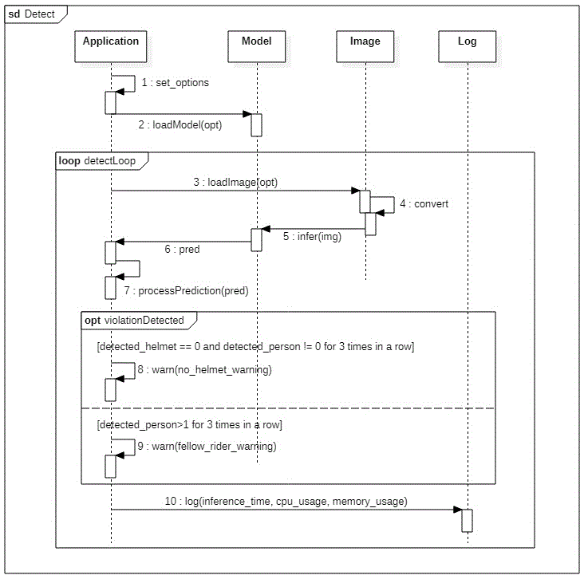

# Capstone Design 2021-2

## Monitor kickboard driver

### Overview

공유 킥보드에 장착하여,  킥보드를 이용하는 사용자들의 도로교통법을 준수 여부를 실시간으로 감시하는 딥러닝 모델 및 구동 스크립트입니다. 감시 범위는 다음과 같습니다.

- 킥보드 이용 중 헬멧의 착용 여부
- 동승자가 탑승했는지 여부

모델 및 구동 스크립트는 [YOLOv5](https://github.com/ultralytics/yolov5) 를 베이스로 제작하였으며, [open-images-dataset-v6](https://opensource.google/projects/open-images-dataset) 와 [cooc-2017](https://cocodataset.org/#home) 을 데이터셋으로 활용하였습니다.

### Contributers

- 김영교
- 원지운

### Test Environment
Hardware : Raspberry Pi 4 B+
Camera : Raspberry Pi Camera Module V2, 8MP
OS : Raspbian OS (Buster)

### How to start

1. Create virtual environment with anaconda and activate

```bash
$ conda env create -f environment.yaml
$ conda activate kickboard
```

2. Install required packages via `pip and apt`

* pytorch and vision for raspberry pi 4b 설치
[링크](https://github.com/sungjuGit/PyTorch-and-Vision-for-Raspberry-Pi-4B)에서 라즈베리파이 4B용으로 빌드된 torch 1.8, torchvision 0.9 파일을 설치합니다.

* onnxruntime for raspberry pi-linux 설치
[링크](https://github.com/nknytk/built-onnxruntime-for-raspberrypi-linux/tree/master/wheels/buster)에서 라즈베리파이용으로 빌드된 onnx 런타임 패키지 중 onnxruntime-1.8.1-cp37-cp37m-linux_armv7l.whl 파일을 받아 설치합니다.
*  sip 및 PyQt5 사용을 위한 패키지 설치(with apt)
apt를 사용하여 다음 패키지들을 설치합니다.
```bash
$ sudo apt-get update
$ sudo apt-get install qt5-default pyqt5-dev pyqt5-dev-tools
```
*  requirements.txt 설치
```bash
$ pip install -r requirements.txt
```

* PyQt5 및 sip 패키지가 설치 문제가 발생할 경우
라즈베리 파이에서 가상 환경에 패키지를 설치할 경우, PyQt5 및 sip 패키지 설치 이슈가 있을 수 있습니다.  [링크](https://insidedarkweb.com/raspberry-pi/pyqt5-on-a-raspberry-pi/)를 참조하여, 직접 패키지를 빌드 후 설치합니다.
```bash
$ wget https://www.riverbankcomputing.com/static/Downloads/sip/4.19.24/sip-4.19.24.tar.gz
$ tar -xzvf sip-4.19.24.tar.gz
$ cd sip-4.19.24
$ python configure.py
$ make
$ make install
$ cd ../
$ wget https://www.riverbankcomputing.com/static/Downloads/PyQt5/PyQt5-5.15.1.dev2008081558.tar.gz
$ tar -xzvf PyQt5-5.15.1.dev2008081558.tar.gz
$ cd PyQt5-5.15.1.dev2008081558
$ python configure.py
$ make
$ make install
$ pip3 install PyQt5-sip
```

3. Execute python detecting scripts
4개의 detect 스크립트 중 원하는 옵션의 스크립트를 실행합니다. 스크립트는 시스템에 설치된 카메라에서 실시간으로 이미지를 받아 헬멧과 주행자 이미지를 탐지합니다. 각 스크립트는 onnx 또는 pt weight 사용 여부, GUI 사용 여부에 따라 선택하시면 됩니다.  GUI는 PyQt5를 이용하여 간단하게 구현하였으며, 가장 탐지 성능이 높은 스크립트는 detect_violation_onnx.py 스크립트입니다.
```bash
$ python3 detect_violation.py
$ python3 detect_violation_GUI_onnx.py
$ python3 detect_violation_GUI_pt.py
$ python3 detect_violation_onnx.py
```

### Sequence Diagram
각 스크립트의 작동을 나타낸 시퀀스 다이어그램입니다.



### Results

- Model: [Latest train result](https://wandb.ai/skywrace/YOLOv5/runs/2zjutty7?workspace=user-skywrace)


- Dataset

> You can download whole dataset from [google drive](https://drive.google.com/file/d/1TAfWtRUx9GWePiC-44JHdzZcemKdJCFv/view?usp=sharing)

> Dataset should be placed on outside of this repository

```yaml
# datasets/custom/dataset.yaml

train: ../datasets/custom/train/images 
val: ../datasets/custom/valid/images
nc: 2
names: ['Helmet', 'Person']
```

- Trained models
/trained_weights 폴더에서 날짜별로 정리된 예전 버전의 weight 파일들을 확인하실 수 있습니다.

## Conclusion

* detect_violation_onnx.py 구동 스크린샷


### References

- https://github.com/ultralytics/yolov5
- https://opensource.google/projects/open-images-dataset
- https://cocodataset.org/#home
- https://github.com/sungjuGit/PyTorch-and-Vision-for-Raspberry-Pi-4B
- https://github.com/nknytk/built-onnxruntime-for-raspberrypi-linux/tree/master/wheels/buster
- https://insidedarkweb.com/raspberry-pi/pyqt5-on-a-raspberry-pi/
